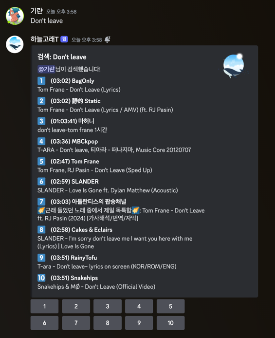
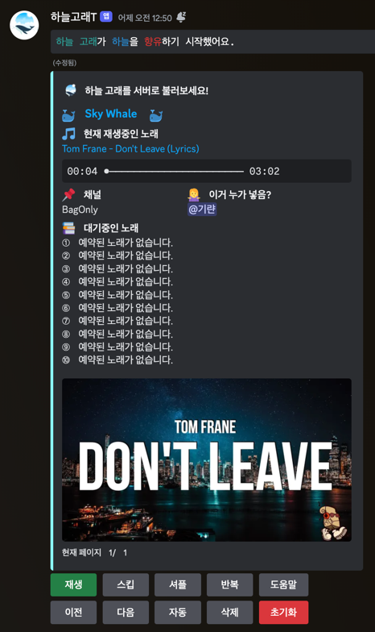

<div align="center">

## 하늘 고래 🐳


하늘 고래는 유튜브에서 음악을 검색하고 재생하는 디스코드 음악 봇입니다.

부가 기능을 최대한 제거하고 음악 기능에만 집중합니다.

디스코드 서버에 활력을 더해보세요!

</div>

## 목차

- [설치](#설치)
- [기능](#기능)

## 사용

### [1] [하늘 고래](https://discord.gg/T92wcQuznv) 초대하기

하늘 고래 봇을 직접 초대하고 사용해보세요!

### [2] 로컬에서 실행하기

Docker로 직접 하늘 고래를 실행할 수 있습니다.
로컬에서 실행하게 되면 서버를 직접 운영하는 것이기 때문에 노래 끊김 현상이 눈에 띄게 줄어듭니다.

> Linux 환경을 추천합니다.
>
> macOS와 Windows에서는 Docker를 사용해도 끊김이 발생할 수 있습니다.

1. `.env` 파일을 생성합니다.

   ```shell
		 DISCORD_BOT_TOKEN= # 디스코드 봇 토큰
		 ADMIN_GUILD_ID= # 관리자 길드 ID
	 
		 WAVELINK_URI= # Lavalink 서버 주소 (예: http://localhost:2333)
		 WAVELINK_PASSWORD= # Lavalink 비밀번호
		 WAVELINK_PORT= # Lavalink 포트 (예: 2333)
	 
		 SUPABASE_URL= # Supabase Database Url
		 SUPABASE_KEY= # Supabase Database Key
	 ```

1. [`setting.py`](./setting.py) 파일을 수정합니다.

   ```python
		 NUM_OF_SEARCH =  # 검색 결과 개수
		 DEFAULT_IMG =  # 기본 썸네일
		 DEFAULT_COLOR =  # 검색 임베드 색상
		 DEFAULT_DELETE_COLOR =  # 삭제 임베드 색상
		 CHANNEL_NAME =  # 음악 채널 이름
		 DEFAULT_DISCORD_INVITE_URL =  # 봇 초대 링크
		 DEFAULT_DISCORD_GUILD_URL =  # 디스코드 길드 링크
		 INIT_MSG =  # 음악 채널 생성 메시지
	 ```

1. Docker로 실행합니다.

   ```shell
	 docker compose up --build
	 ```

## 기능

- 하늘 고래 전용 채널
- 음악 재생
  <details>
    <summary>전용 채널에서 채팅을 치면 노래를 검색합니다.</summary>

  

  </details>

  <details>
    <summary>검색 결과를 선택하면 노래를 재생합니다.</summary>

  

  </details>

- 명령어

  컨트롤러의 버튼으로도 사용할 수 있습니다.

  | 명령어     | 설명                  |
        	|:--------|:--------------------|
  | /고래 정지  | 노래를 일시정지 혹은 재생합니다.  |
  | /고래 스킵  | 현재 노래를 스킵합니다.       |
  | /고래 셔플  | 재생목록을 섞습니다.         |
  | /고래 반복  | 현재 노래를 반복합니다.       |
  | /고래 이전  | 이전 재생목록 페이지로 이동합니다. |
  | /고래 다음  | 다음 재생목록 페이지로 이동합니다. |
  | /고래 자동  | 자동 재생을 설정합니다.       |
  | /고래 삭제  | 재생목록에 노래를 하나 삭제합니다. |
  | /고래 초기화 | 버그가 있으면 초기화합니다.     |
